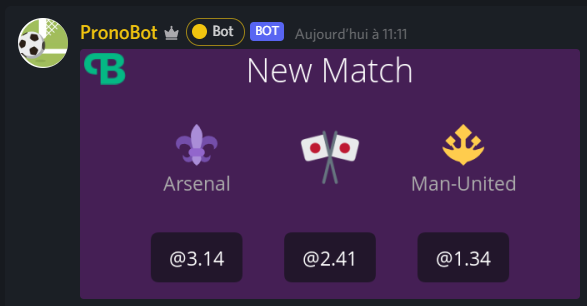
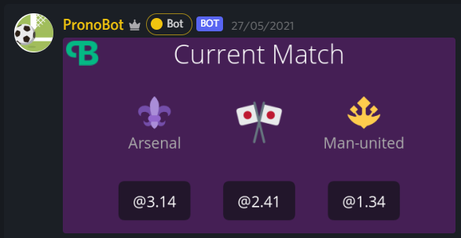

# PronoBot
A Discord Bot to create match and bet on it without danger

Default bot prefix is : **&**  
Default language of the bot is : **fr** [fr, en]

Our Website [pronobot.top](https://pronobot.top)  
If you have questions or returns do it on our [Discord Server](https://discord.gg/rbrPpWbEnV)

Vote for the bot on [Top.gg](https://top.gg/bot/835256483356737546)

****

### Commands

All Bot's commands are split in 5 categories 

- #### [User Commands](#User)
- #### [Match Commands](#Match)
- #### [Config Commands](#Config)
- #### [General Commands](#General)
- #### [Admin Commands](#Admin)

You can also find a tutorial with the arguments of each order on our website

****

### User

These commands are available to all users with an account

- open
- daily
- balance
- coinflip
- stats
- transfer
- bet
- unbet
- mybets
- close

Commands in progress :
- myinfo
- vote

#### Example :

Do `> &open` to your account, a new user is automatically credited with 20 coins  
A user can close at every moment is account with `> &close`, all bets in progress 
statistics and in the future xp and levels will be deleted 

The `> &daily` command credit 5 coins on the executor's account

To bet use the command with specific args of the in progress match on your server
`> &bet <club> <stake>`  
>`&bet psg 20` Here we bet 20 on PSG  

The user automatically receives a message validating the bet  
Do `> &unbet` to delete your bet in progress

Transfer money to any user of a server that has an account `> &transfer <money> <user>`
>`&transfer 45 @Hokanosekai` Transfer 45 coins to Hokanosekai

****

### Match

Available only for Administrator  
(A role system will soon be added)

- create
- match
- delete
- result

#### Example

To create a new match, type a command like `> &create <club1> @<float> nul @<float> <club2> @<float>`. 

>`&create arsenal @1.4 nul @2.4 man-united @3.1` We create a match Arsenal VS Manchester United

Note at this time you have a limit of one match per server,
so if you want to create a new match,
please delete the last one or define the match winner

Please do not enter space in club name and capital letters are not taken into account

Delete a match in progress by typing `> &delete`, this will automatically return the money
to all betters

Define the winner of a match with `> &result <winning club>`, numbers of game, loose, win and 
money is automatically change

For the match creation message the bot will no longer send an embed but a png image generated with Canvas  

- create command when a new match is set up
  

- match command to see current match

****

### Config

"set" commands are available only for Administrators
 - setlang
 - setprefix
 - setnotif

# Other commands is available for every people in each server
- botinfo
- servinfo
- share
- help

#### Example

Change Default language with `> &setlang <lang>`, note today there is only two lang [fr, en]  

To change the default prefix use `> &setprefix <new prefix>`

The Bot notify user of the news with a role call "Notif PronoBot" this role 
is automatically created when the bot is added on a server. You can change this default
role with `> &setnotif <ID of new role>`

If you like the concept you can share the bot to all users with `> &share`

To view all commands or view a specific command `> &help optional: <command name>`
****

### General

We can also call this category "Top" because it gathers the commands allowing to see the different ranking
- topmoney
- topgame
- toploose
- topwin

****

### Admin

These commands are usable only by the bot owners, maybe for server admins in the future.

****

PronoBot - © 2021
